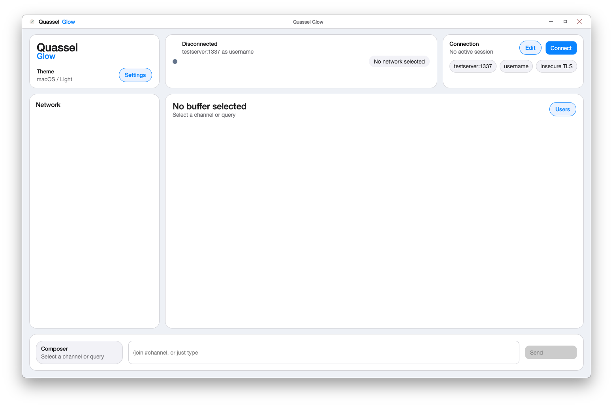
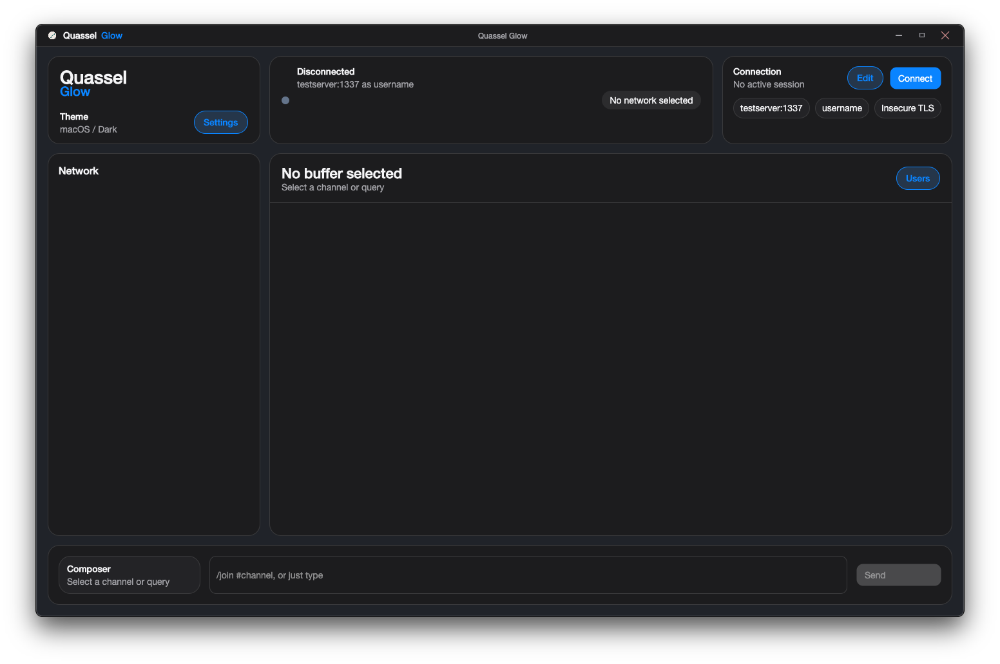
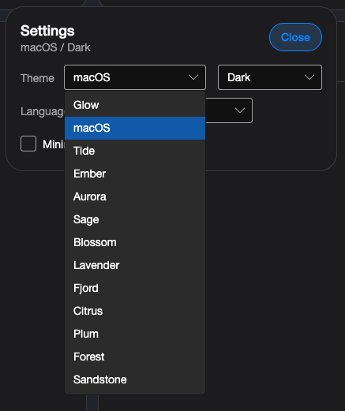
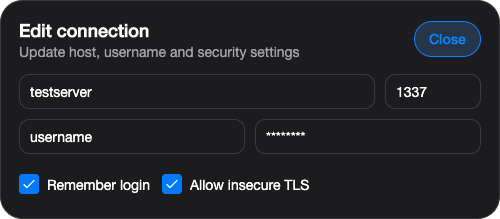

# QuasselGlow

QuasselGlow is a cross-platform desktop client for the Quassel protocol, built with Avalonia and .NET.

The project aims to offer a modern desktop experience inspired by classic IRC clients while staying lightweight, responsive, and usable on Windows, Linux, and macOS.

## Screenshots

### Light Theme



### Dark Theme



### Settings



### Connection View



## Status

QuasselGlow is an early-stage project. The current build includes:

- Quassel core connection and authentication
- Network, buffer, and backlog loading
- Local buffer history cache with incremental catch-up on reconnect
- Message sending
- Clickable links in chat messages
- Quassel-style per-buffer input history and draft recall
- Nick autocomplete in channels with repeated `Tab` cycling through matches
- Automatic reconnect to the remembered server on startup
- A custom desktop UI built with Avalonia
- Local connection settings storage
- Theme selection, tray support, pinned user list, and localized UI labels
- Language selection covering the full locale list shipped by the official Quassel client
- Avalonia 12-based desktop UI packaging with updated placeholder APIs and macOS-specific custom title bar handling

## Tech Stack

- .NET 10
- Avalonia UI 12
- CommunityToolkit.Mvvm
- xUnit

## Solution Layout

- `src/QuasselGlow`
  - Avalonia desktop application, views, styling, and window behavior
- `src/Quassel.Client.Application`
  - Application logic and shared app-level helpers
- `src/Quassel.Client.Domain`
  - Core models for sessions, networks, buffers, and messages
- `src/Quassel.Client.Protocol`
  - Quassel transport, framing, handshake, sync, and protocol handling
- `src/Quassel.Client.Infrastructure`
  - Persistence and runtime services
- `tests/Quassel.Client.Application.Tests`
  - Application-layer tests
- `tests/Quassel.Client.Protocol.Tests`
  - Protocol-layer tests

## Getting Started

### Requirements

- .NET SDK 10.0 or newer

### Local Linux setup

This repository is set up to work with a user-local .NET install. On this machine, the SDK was installed to `~/.dotnet`.

Add it to your shell path:

```bash
export PATH="$HOME/.dotnet:$PATH"
```

For sandboxed or isolated environments, you can keep CLI state and NuGet packages inside the repository:

```bash
export DOTNET_CLI_HOME="$PWD/.dotnet-home"
export NUGET_PACKAGES="$PWD/.nuget/packages"
mkdir -p "$DOTNET_CLI_HOME" "$NUGET_PACKAGES"
```

### Build

```powershell
dotnet build Quassel.slnx
```

### Run the desktop client

```powershell
dotnet run --project .\src\QuasselGlow\QuasselGlow.csproj
```

### Run tests

```powershell
dotnet test Quassel.slnx
```

### Create release artifacts

```powershell
.\scripts\Publish-Release.ps1
```

This publishes self-contained release builds for `win-x64`, `linux-x64`, `linux-arm64`, `osx-x64`, and `osx-arm64` into `.artifacts/releases/<version>/`, writes `SHA256SUMS.txt`, creates platform archives, and seeds a `RELEASE_NOTES.md` file if one does not already exist.

The release version is centralized in `Directory.Build.props`. If you omit `-Version`, the publish script will use that shared `VersionPrefix`. On macOS the script also emits a signed `QuasselGlow.app` bundle, a zip that contains the app bundle, and a `.dmg`.

### Install or update the local Linux app

```bash
./scripts/install-linux-local.sh
```

This builds the current `Release` Linux version, installs the binary into `~/.local/opt/QuasselGlow/`, copies the icon into `~/.local/share/icons/`, and refreshes the app launcher in `~/.local/share/applications/quasselglow.desktop`.

## Configuration

The app stores local connection settings in the user's local application data folder. Credentials are protected per user on Windows through DPAPI when possible.

The selected UI language is also stored locally. QuasselGlow exposes the same locale list as the official Quassel translation set and ships with translated UI labels for that full locale set.

Connection preferences now distinguish between connecting automatically on startup and reconnecting automatically after a live Quassel core session is lost. The reconnect option waits until the desktop client has reached an active session, then retries with the current connection preferences unless the user disconnects manually.

Recent desktop polish includes persisted themes with dark mode, wallpaper-matched appearance, PM and mention alerts, tray support, emoji-friendly font fallback, composer autofocus after connecting, startup auto-connect for remembered login, automatic reconnect after lost Quassel core sessions, nick autocomplete with `Tab`, a permanently pinned user list in desktop layout, and local message cache for faster channel startup after reconnecting.

## Recent Release Notes

The `v0.2.11` update adds protocol heartbeat monitoring so QuasselGlow can detect a lost Quassel core connection instead of staying silently connected on a dead stream. A new connection preference lets users automatically reconnect after an active session is lost while still respecting manual disconnects.

This release also keeps the Quassel DataStream heartbeat timestamp compatible with Qt `QDateTime`, persists the new reconnect preference with the rest of the connection preferences, and expands regression coverage around heartbeat timeouts and reconnect behavior.

A follow-up desktop polish change highlights user-list nick rows on hover so channel users are easier to scan before opening their context menu.

## Notes

- This project is not an official Quassel release.
- The repository does not include any server credentials or private deployment settings.

## Roadmap Ideas

- More complete Quassel sync coverage
- Richer buffer and user list handling
- Better packaging for Windows, Linux, and macOS
- Installer polish
