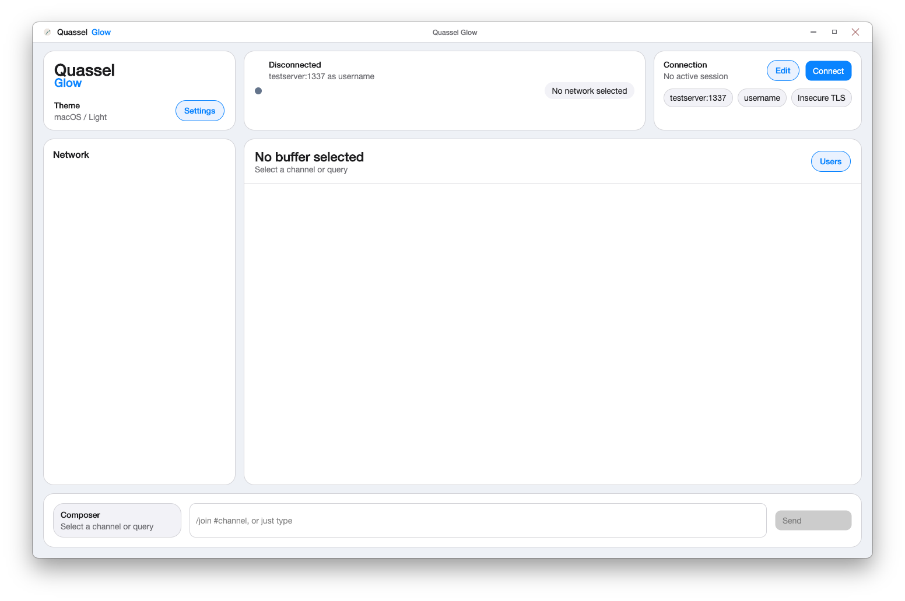
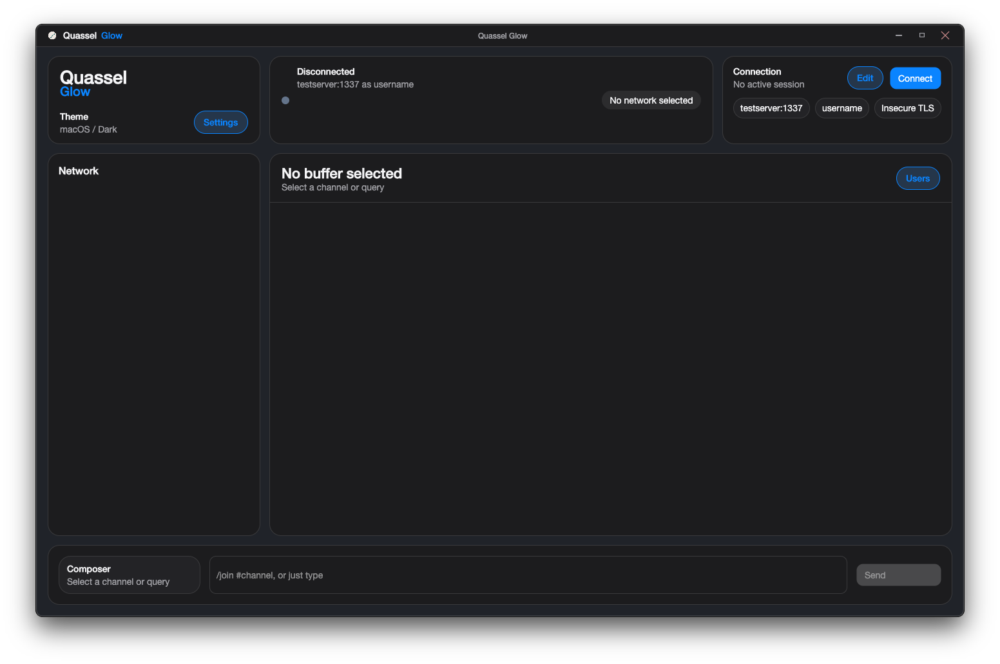
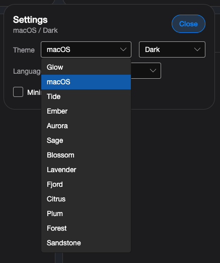
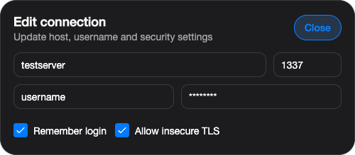

# QuasselGlow

QuasselGlow is a cross-platform desktop client for the Quassel protocol, built with Avalonia and .NET.

The project aims to offer a modern desktop experience inspired by classic IRC clients while staying lightweight, responsive, and usable on Windows, Linux, and macOS.

## Screenshots

> The screenshots below show the previous layout. Captures for the redesigned
> interface are pending.

### Light Theme



### Dark Theme



### Settings



### Connection View



## Status

QuasselGlow is an early-stage project. The current build includes:

- Quassel core connection and authentication
- Network, buffer, and backlog loading
- Local buffer history cache with incremental catch-up on reconnect
- Message sending
- Clickable links in chat messages
- Incoming DCC CHAT offers with a dedicated direct-chat window for games and conversations
- Quassel-style per-buffer input history and draft recall
- Nick autocomplete in channels with repeated `Tab` cycling through matches
- Automatic reconnect to the remembered server on startup
- A flat, classic three-column desktop UI built with Avalonia
- Local connection settings storage
- Theme selection, tray support, pinned user list, and localized UI labels
- Language selection covering the full locale list shipped by the official Quassel client
- Avalonia 12-based desktop UI packaging with updated placeholder APIs and macOS-specific custom title bar handling

## Desktop UI

The desktop client uses a flat, classic IRC workbench layout:

- A thin app-rendered title bar with the brand, the active buffer name and the window controls.
- A status strip directly under the title bar with the connection state, detail text, session summary and the connection actions.
- A three-column work area: network/buffer tree, flat message log and nick list.
- A single-line composer pinned to the bottom.

The redesign replaces the earlier card-and-gradient dashboard with flat surfaces, a single interactive accent colour and 6–7 px corner radii. All existing behaviour, commands, context menus, alert badges and themes are preserved.

The earlier card-based layout is available as the **Modern interface**. The flat IRC workbench is the **Classic interface**. The **Modern interface** toggle in Settings switches between them live, without restarting or dropping the Quassel core session. Existing installations retain their selected layout.

Both interfaces use stable pastel nickname colours in the message log and user list. Each nickname keeps the same colour across channels and layouts, with lighter shades in dark mode and muted pastel shades in light mode.

See [docs/GUI_REDESIGN.md](docs/GUI_REDESIGN.md) for the full design notes and [docs/gui-proposals.html](docs/gui-proposals.html) for the design directions that were considered.

## DCC CHAT and MUD games

Incoming active `DCC CHAT chat <address> <port>` offers show **Accept DCC chat**
and **Decline** in both interfaces. For OpenMUD, send `!play` in its IRC query,
then accept the new offer before the bot expires it. The game opens in a separate
window. Press Enter to send a command and use Up/Down to recall command history.
Blank lines and commands beginning with `/` are sent directly to the game.
Long lines wrap to fit the window. `!login` and `/login` arguments are masked in
the local transcript and these commands are excluded from command history.
Closing the game window or choosing Disconnect closes its socket. Changing the
IRC layout keeps the game connection open.

The connection runs from the desktop directly to the offered IP and port, without
routing through the Quassel core. DCC CHAT is unencrypted, and the peer sees the
desktop's IP address. Offers are never accepted automatically, and historical
backlog offers cannot be accepted. Chat output supports UTF-8, preserves maps and
partial prompts, renders IRC colors and text styles, and removes terminal escape
commands. IRC messages and channel topics use the same formatting parser in both
layouts; sidebar previews use plain text. This is a text chat window,
not a full ANSI/telnet terminal; ANSI colours and cursor control are not rendered.

This implementation accepts active CHAT offers using numeric IPv4, dotted IPv4
or IPv6 addresses. It does not initiate outgoing offers, transfer files, or
negotiate passive/reverse DCC (port zero). It requires the offer payload to reach
the client. Some Quassel cores consume CTCP requests and display only “Received
unknown CTCP-DCC request” without the endpoint; the client cannot recover the
address and port when the core discards them. See the
[Quassel core event stringifier](https://github.com/quassel/quassel/blob/master/src/core/eventstringifier.cpp).

## Tech Stack

- .NET 10
- Avalonia UI 12
- CommunityToolkit.Mvvm
- xUnit

## Solution Layout

- `src/QuasselGlow`
  - Avalonia desktop application, views, styling, and window behavior
- `src/Quassel.Client.Application`
  - Application logic and shared app-level helpers
- `src/Quassel.Client.Domain`
  - Core models for sessions, networks, buffers, and messages
- `src/Quassel.Client.Protocol`
  - Quassel transport, framing, handshake, sync, and protocol handling
- `src/Quassel.Client.Infrastructure`
  - Persistence and runtime services
- `tests/Quassel.Client.Application.Tests`
  - Application-layer tests
- `tests/Quassel.Client.Protocol.Tests`
  - Protocol-layer tests

## Getting Started

### Requirements

- .NET SDK 10.0 or newer

### Local Linux setup

This repository is set up to work with a user-local .NET install. On this machine, the SDK was installed to `~/.dotnet`.

Add it to your shell path:

```bash
export PATH="$HOME/.dotnet:$PATH"
```

For sandboxed or isolated environments, you can keep CLI state and NuGet packages inside the repository:

```bash
export DOTNET_CLI_HOME="$PWD/.dotnet-home"
export NUGET_PACKAGES="$PWD/.nuget/packages"
mkdir -p "$DOTNET_CLI_HOME" "$NUGET_PACKAGES"
```

### Build

```powershell
dotnet build Quassel.slnx
```

### Run the desktop client

```powershell
dotnet run --project .\src\QuasselGlow\QuasselGlow.csproj
```

### Run tests

```powershell
dotnet test Quassel.slnx
```

### Create release artifacts

```powershell
.\scripts\Publish-Release.ps1
```

This publishes self-contained release builds for `win-x64`, `linux-x64`, `linux-arm64`, `osx-x64`, and `osx-arm64` into `.artifacts/releases/<version>/`, writes `SHA256SUMS.txt`, creates platform archives, and seeds a `RELEASE_NOTES.md` file if one does not already exist.

The release version is centralized in `Directory.Build.props`. If you omit `-Version`, the publish script will use that shared `VersionPrefix`. On macOS the script emits a signed `QuasselGlow.app` bundle inside a zip archive.

### Install or update the local Linux app

```bash
./scripts/install-linux-local.sh
```

This builds the current `Release` Linux version, installs the binary into `~/.local/opt/QuasselGlow/`, copies the icon into `~/.local/share/icons/`, and refreshes the app launcher in `~/.local/share/applications/quasselglow.desktop`.

## Configuration

The app stores local connection settings in the user's local application data folder. Credentials are protected per user on Windows through DPAPI when possible.

The selected UI language is also stored locally. QuasselGlow exposes the same locale list as the official Quassel translation set and ships with translated UI labels for that full locale set.

Connection preferences now distinguish between connecting automatically on startup and reconnecting automatically after a live Quassel core session is lost. The reconnect option waits until the desktop client has reached an active session, then retries with the current connection preferences unless the user disconnects manually.

Recent desktop polish includes persisted themes with dark mode, wallpaper-matched appearance, PM and mention alerts, tray support, emoji-friendly font fallback, composer autofocus after connecting, startup auto-connect for remembered login, automatic reconnect after lost Quassel core sessions, nick autocomplete with `Tab`, a permanently pinned user list in desktop layout, and local message cache for faster channel startup after reconnecting.

## Recent Release Notes

The `v0.3.3` update fixes text rendering in both interfaces and DCC. IRC colors
(including extended and hex colors), bold, italics, underline, strikethrough,
monospace and reverse colors are rendered in messages and channel topics.
Sidebar previews remain plain text, and formatted links stay clickable.
DCC color codes split across network reads are handled correctly, long lines wrap
to the window, and `!login` / `/login` arguments are masked in the local transcript
and excluded from command history.
Nickname colors are generated and reserved per nickname instead of repeating a
12-color palette. They remain pastel and match between messages and the roster
in both layouts and themes throughout the session. Release downloads include
native icon assets; macOS app bundles contain the icon referenced by their plist.

The `v0.3.2` update added incoming DCC CHAT support with explicit acceptance,
a separate game window, command history and partial prompts. It also corrected
the interface names: the flat IRC layout is Classic and the card layout is Modern.
Both interfaces use the same pastel nickname colors in chat and the user list,
with existing layout preferences preserved.

All 152 application tests and 6 protocol tests pass, including uniqueness checks
for 4,096 nicknames in both themes. The DCC connection has been tested with a local TCP server,
and both interfaces and the minimum-width game window have been checked in an
isolated GUI test. A live OpenMUD session verified login, stats, looking, the map,
and movement out of town and back. The attack command returned the game's normal
response that no fight was available there; combat itself was not exercised.
See the DCC CHAT section above for protocol and core compatibility limits.

## Notes

- This project is not an official Quassel release.
- The repository does not include any server credentials or private deployment settings.

## Roadmap Ideas

- More complete Quassel sync coverage
- Richer buffer and user list handling
- Better packaging for Windows, Linux, and macOS
- Installer polish
